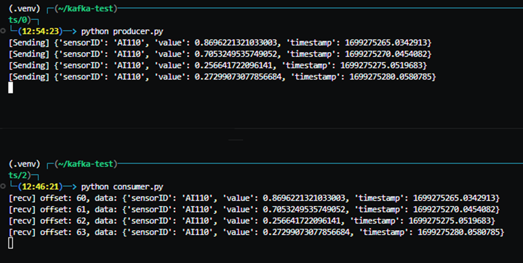

<p align="center">
    
</p>

# Dive into Kafka

### Table of Contents:
- [Getting Started](#getting-started)
- [Schema Registry](#schema-registry)
- [Kafka Connect](#kafka-connect)

---
### Getting Started
<div align="justify">
Apache Kafka is an open-source fault-tolerant messaging system based on the publish-subscribe model. Kafka is known for its speed, scalability, and distributed architecture by design.
</div>

Use cases:
- **Microservices Communication:** It's often used as a communication backbone for microservices architectures, ensuring reliable and asynchronous communication between services.
- **Log and Event Streaming:** Kafka is ideal for collecting and processing log and event data from various sources, making it valuable for monitoring, analytics, and auditing.
- **Data Integration:** Many organizations use Kafka to connect disparate data systems, enabling efficient data sharing and integration between applications.
- **Real-time Analytics:** Kafka enables real-time data streaming, supporting applications for real-time analytics, dashboarding, and decision-making.
- **IoT and Sensor Data:** It's an excellent choice for managing data from Internet of Things (IoT) devices and sensors, allowing for the real-time processing of vast amounts of data.
- **Machine Learning and AI:** Kafka can be integrated into machine learning and artificial intelligence pipelines to facilitate real-time data ingestion and model training.

<p align="center">
    
</p>

What are **producers**:
> Producers are clients that write events to Kafka. The producer specifies the topics they will write to and the producer controls how events are assigned to partitions within a topic. This can be done in a round-robin fashion for load balancing or it can be done according to some semantic partition function such as by the event key.

What are **consumers**:
> Consumers are clients that read events from Kafka.

<div align="justify">
In this context, we are setting up a Kafka server within a Docker environment. To streamline the process, we'll create a bash script file (deploy.sh) responsible for pulling and launching "kafka-server" and "kafka-topic-creator" services.
</div>

[deploy.sh](src/getting-started/deploy.sh)
```bash
#!/bin/bash

echo "pulling confluent kafka image from docker hub..."
docker pull confluentinc/cp-kafka:7.5.0
docker compose -f kafka-compose.yaml up -d
```

At line 4 we pull the Kafka image from docker hub, and in line 5 we use `docker compose` command to run two docker services. The services are defined in `kafka-compose.yaml` file.

[kafka-compose.yaml](src/getting-started/kafka-compose.yaml)
```yaml
 version: "3.8"

services:
  kafka-server:
      image: confluentinc/cp-kafka:7.5.0
      hostname: kafka-server
      container_name: kafka-server
      ports:
        - 9092:9092
      volumes:
        - kafka-log:/var/lib/kafka/data
      environment:
        KAFKA_LISTENER_SECURITY_PROTOCOL_MAP: "CONTROLLER:PLAINTEXT,PLAINTEXT:PLAINTEXT,PLAINTEXT_HOST:PLAINTEXT"
        KAFKA_ADVERTISED_LISTENERS: "PLAINTEXT://kafka-server:29092,PLAINTEXT_HOST://localhost:9092"
        KAFKA_LISTENERS: "CONTROLLER://kafka-server:19092,PLAINTEXT://kafka-server:29092,PLAINTEXT_HOST://0.0.0.0:9092"
        CLUSTER_ID: "0000000000000000000000"
        KAFKA_NODE_ID: 1
        KAFKA_PROCESS_ROLES: "broker,controller"
        KAFKA_CONTROLLER_QUORUM_VOTERS: "1@kafka-server:19092"
        KAFKA_INTER_BROKER_LISTENER_NAME: "PLAINTEXT"
        KAFKA_CONTROLLER_LISTENER_NAMES: "CONTROLLER"
        KAFKA_OFFSETS_TOPIC_REPLICATION_FACTOR: 1
        KAFKA_DEFAULT_REPLICATION_FACTOR: 1
      
  kafka-topic-creator:
    image: confluentinc/cp-kafka:7.5.0
    hostname: kafka-topic-creator
    container_name: kafka-topic-creator
    depends_on:
      - kafka-server
    command:
      - bash
      - -c
      - |
        echo "Check if kafka-server is ready... "
        cub kafka-ready -b kafka-server:29092 1 10
        echo "Creating a topic with the name 'sensors'"
        kafka-topics --create --if-not-exists --bootstrap-server kafka-server:29092 --partitions 1 --replication-factor 1 --topic sensors 

volumes:
  kafka-log:
```

In the [kafka-compose.yaml](src/getting-started/kafka-compose.yaml), we specify the Docker services and configure essential environmental variables required to initiate a Kafka broker. Additionally, we expose port `9092` to enable access to the Kafka server from outside the Docker network. 

<div align="justify">
If you are familiar with Kafka you can see that we use the `Raft` mode instead of `zookeepers`. Raft mode provides a more streamlined and self-contained way for Kafka to manage controller elections without the need for an external coordination service like Zookeeper. This can simplify the deployment and management of Kafka clusters.
The `kafka-topic-creator` service verifies the availability of the "kafka-server" by running the `cub kafka-ready` command. Once the kafka-server is confirmed to be ready to receive commands, it proceeds to execute the `kafka-topic` command, creating a topic named "sensors". Subsequently, the service exits after successfully creating the topic.

Now we have a working kafka broker with a topic named "sensors". We will create two python scripts, one for Producing messages and another for Consuming them. We will use "kafka-python" library for working with kafka in python. to install "kafka-python" you can run the following command:
```pip install kafka-python```

the producer will produce a json message every 5 seconds and sends(or publishes) it to "sensors" topic.
</div>

[producer.py](src/getting-started/producer.py)
```python
from kafka import KafkaProducer
import json
import time
import random

producer = KafkaProducer(bootstrap_servers=['localhost:9092'],
                         value_serializer=lambda x:
                         json.dumps(x).encode('utf-8'))

while True:
    data = {"sensorID": "AI110", "value": random.random(), "timestamp": time.time()}
    print("[Sending]", data)
    producer.send('sensors', value=data)
    time.sleep(5)
```


<div align="justify">
In this code we simply create a "KafkaProducer" object and set its "value_serializer" to a lambda function which gets a dictionary object and converts it to a text string.
</div>

The consumer listens to topic "sensors" and prints(or consumes) every message.

[consumer.py](src/getting-started/consumer.py)
```python
from kafka import KafkaConsumer
import json

consumer = KafkaConsumer(
    'sensors',
    bootstrap_servers=['localhost:9092'],
    auto_offset_reset='latest',
    enable_auto_commit=True,
    value_deserializer=lambda x: json.loads(x.decode('utf-8')))

for message in consumer:
    print(f"[recv] offset: {message.offset}, data: {message.value}")
```

here is the result of running both producer and consumer scripts:
<p align="center">
    
</p>

---

### Schema Registry

<p align="justify">
Schema registry is a service in the Kafka ecosystem that is used for managing and storing the schemas of messages produced and consumed by Kafka producers and consumers. 
It is recommended hat each producer registers the schema of its messages in schema-registry so the consumers can read the schema and understand the format of the messages they consume.
</p>

> Schema Registry provides several benefits, including data validation, compatibility checking, versioning, and evolution. It also simplifies the development and maintenance of data pipelines and reduces the risk of data compatibility issues, data corruption, and data loss.

<p align="justify">
Consider a scenario with 10 producers generating 5 types of messages. Note that these producers serialize their messages into byte arrays before puting them to Kafka, leaving consumers unaware of the message schema or format. To bridge this gap, producers register their message format (schema) in the schema-registry. This allows consumers to retrieve the schema, enabling them to understand the message formats and properly deserialize the messages they consume.
</p>

<p align="justify">
For using schema-registry we need to run it first. Confluent has made it simple for us by providing a docker image. We can pull <mark>confluentinc/cp-schema-registry</mark> image from docker hub and run it. To do so, we can modify our <mark>deploy.sh</mark> file to the following:
</p>


[deploy.sh](src/schema-registry/deploy.sh)
```
#!/bin/bash

echo "pull confluent kafka image from docker hub..."
docker pull confluentinc/cp-kafka:7.5.0

echo "Pull confluent schema-registry"
docker pull confluentinc/cp-schema-registry:7.5.0

docker compose -f compose.yaml up -d
```

The [compose.yaml](src/schema-registry/compose.yaml) file in this case should have a service definition for schema-registry.

[compose.yaml](src/schema-registry/compose.yaml)
```
...
schema-registry:
    image: confluentinc/cp-schema-registry:7.5.0
    hostname: schema-registry
    container_name: schema-registry
    ports:
      - 8081:8081
    depends_on:
      - kafka-server
    environment:
      SCHEMA_REGISTRY_HOST_NAME: schema-registry
      SCHEMA_REGISTRY_KAFKASTORE_BOOTSTRAP_SERVERS: "kafka-server:29092"
      SCHEMA_REGISTRY_LISTENERS: http://0.0.0.0:8081
```

Now we can start our Kafka-server, kafka-topic-creator and, schema-registry services by executing the [deploy.sh](src/schema-registry/deploy.sh) script. After a few seconds, ```kafka-server``` is up and running, ```kafka-topic-creator``` creates a topic with the name "sensors", and ```schema-registry``` runs a web service on port ```8081``` which services can send their requests to it and register or read schemas. 
To read more info about ```schema-registry``` web service and its API go to [this](https://docs.confluent.io/platform/current/schema-registry/develop/using.html) link.

To register a new schema in ```schema-registry```, we use a simple python code which sends a ```POST``` request to the schema-registry web service. The following code registers a protobuf schema:

[register-protobuf-schema.py](src/schema-registry/register-protobuf-schema.py)
```python
import requests
import json

PROTO = """
syntax = "proto3";
message Measurement {
    string id = 1;
    int64 timestamp = 2;
    double value = 3;
    uint32 quality = 4;
}"""

payload = {
    "schemaType": "PROTOBUF",
    "schema": PROTO
    }

response = requests.post("http://localhost:8081/subjects/sensors/versions", data=json.dumps(payload))
if response.ok:
    print("schema registered successfully!")
else:
    print("failed to register schema.")
```

As can be seen, we simply define a string variable containing the protobuf definition. We simply send a ```POST``` request to the schema-registry web service and ask it to register our schema into ```sensors``` subject. Note that we specified the type of our schema by defining ```"schemaType": "PROTOBUF"```. If you want to register a json schema, you should set ```"schemaType": "JSON"```. [register-json-schema.py](src/schema-registry/register-json-schema.py) shows an example of registering a json schema.

After registering a schema in ```schema-registry``` you can verify that by sending a ```GET``` request to its web service or simply open your browser and go to folloing URL:

```http://localhost:8081/subjects/sensors/versions/```
or
```http://192.168.210.128:8081/subjects/```

In general, the URL format is as follows:
```http://your-schema-registry-url/subjects/your-subject-name/versions```

Now our schema is registered, consumers can send ```GET``` request to the schema-registry and get the schema(format) of a specific ```subject```.

With our schema successfully registered, consumers have the ability to send a ```GET``` request to the schema-registry, retrieving the schema (format) associated with a specific ```subject```. For instance, if a consumer needs the schema for subject ```sensors``` it can use the information obtained from the following URL:
```http://localhost:8081/subjects/sensors/versions/1```

For ```unregistering``` or deleting a schema from schema-registry, we can send a ```DELETE``` request to the schema-registry. Here is an example:
 ```python
import requests
requests.delete("http://localhost:8081/subjects/sensors/versions/1")
 ```

to be continued ...
