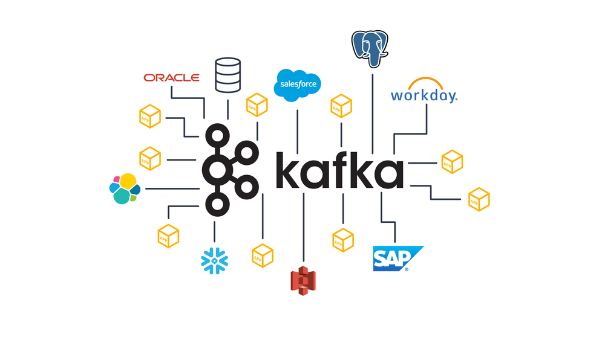

<p align="center">
    
</p>

# Dive into Kafka

### Table of Contents:
- [Getting Started](#getting-started)
- [Kafka Connect](#kafka-connect)

---
### Getting Started
<div align="justify">
Apache Kafka is an open-source fault-tolerant messaging system based on the publish-subscribe model. Kafka is known for its speed, scalability, and distributed architecture by design.

Use cases:
- **Microservices Communication:** It's often used as a communication backbone for microservices architectures, ensuring reliable and asynchronous communication between services.
- **Log and Event Streaming:** Kafka is ideal for collecting and processing log and event data from various sources, making it valuable for monitoring, analytics, and auditing.
- **Data Integration:** Many organizations use Kafka to connect disparate data systems, enabling efficient data sharing and integration between applications.
- **Real-time Analytics:** Kafka enables real-time data streaming, supporting applications for real-time analytics, dashboarding, and decision-making.
- **IoT and Sensor Data:** It's an excellent choice for managing data from Internet of Things (IoT) devices and sensors, allowing for the real-time processing of vast amounts of data.
- **Machine Learning and AI:** Kafka can be integrated into machine learning and artificial intelligence pipelines to facilitate real-time data ingestion and model training.

<p align="center">
    
</p>

What are **producers**:
> Producers are clients that write events to Kafka. The producer specifies the topics they will write to and the producer controls how events are assigned to partitions within a topic. This can be done in a round-robin fashion for load balancing or it can be done according to some semantic partition function such as by the event key.

What are **consumers**:
> Consumers are clients that read events from Kafka.

In this context, we are setting up a Kafka server within a Docker environment. To streamline the process, we'll create a bash script file (deploy.sh) responsible for pulling and launching "kafka-server" and "kafka-topic-creator" services.

[deploy.sh](src/getting-started/deploy.sh)
```{.bash .numberLines .lineAnchors}
#!/bin/bash

echo "pulling confluent kafka image from docker hub..."
docker pull confluentinc/cp-kafka:7.5.0
docker compose -f kafka-compose.yaml up -d
```

At line 4 we pull the Kafka image from docker hub, and in line 5 we use `docker compose` command to run two docker services. The services are defined in `kafka-compose.yaml` file.

[kafka-compose.yaml](src/getting-started/kafka-compose.yaml)
```yaml
 version: "3.8"

services:
  kafka-server:
      image: cp-kafka:7.5.0
      hostname: kafka-server
      container_name: kafka-server
      ports:
        - 9092:9092
      volumes:
        - kafka-log:/var/lib/kafka/data
      environment:
        KAFKA_LISTENER_SECURITY_PROTOCOL_MAP: "CONTROLLER:PLAINTEXT,PLAINTEXT:PLAINTEXT,PLAINTEXT_HOST:PLAINTEXT"
        KAFKA_ADVERTISED_LISTENERS: "PLAINTEXT://kafka-server:29092,PLAINTEXT_HOST://localhost:9092"
        KAFKA_LISTENERS: "CONTROLLER://kafka-server:19092,PLAINTEXT://kafka-server:29092,PLAINTEXT_HOST://0.0.0.0:9092"
        CLUSTER_ID: "0000000000000000000000"
        KAFKA_NODE_ID: 1
        KAFKA_PROCESS_ROLES: "broker,controller"
        KAFKA_CONTROLLER_QUORUM_VOTERS: "1@kafka-server:19092"
        KAFKA_INTER_BROKER_LISTENER_NAME: "PLAINTEXT"
        KAFKA_CONTROLLER_LISTENER_NAMES: "CONTROLLER"
      
  kafka-topic-creator:
    image: cp-kafka:7.5.0
    hostname: kafka-topic-creator
    container_name: kafka-topic-creator
    depends_on:
      - kafka-server
    command:
      - bash
      - -c
      - |
        echo "Check if kafka-server is ready... "
        cub kafka-ready -b kafka-server:29092 1 10
        echo "Creating a topic with the name 'sensors'"
        kafka-topics --create --if-not-exists --bootstrap-server kafka-server:29092 --partitions 1 --replication-factor 1 --topic sensors 

volumes:
  kafka-log:
```

In the [kafka-compose.yaml](src/getting-started/kafka-compose.yaml), we specify the Docker services and configure essential environmental variables required to initiate a Kafka broker. Additionally, we expose port `9092` to enable access to the Kafka server from outside the Docker network. If you are familiar with Kafka you can see that we use the `Raft` mode instead of `zookeepers`. Raft mode provides a more streamlined and self-contained way for Kafka to manage controller elections without the need for an external coordination service like Zookeeper. This can simplify the deployment and management of Kafka clusters.
The `kafka-topic-creator` service verifies the availability of the "kafka-server" by running the `cub kafka-ready` command. Once the kafka-server is confirmed to be ready to receive commands, it proceeds to execute the `kafka-topic` command, creating a topic named "sensors". Subsequently, the service exits after successfully creating the topic.

Now we have a working kafka broker with a topic named "sensors". We will create two python scripts, one for Producing messages and another for Consuming them. We will use "kafka-python" library for working with kafka in python. to install "kafka-python" you can run the following command:
```pip install kafka-python```

the producer will produce a json message every 5 seconds and sends(or publishes) it to "sensors" topic.

[producer.py](src/getting-started/producer.py)
```python
from kafka import KafkaProducer
import json
import time
import random

producer = KafkaProducer(bootstrap_servers=['localhost:9092'],
                         value_serializer=lambda x:
                         json.dumps(x).encode('utf-8'))

while True:
    data = {"sensorID": "AI110", "value": random.random(), "timestamp": time.time()}
    print("[Sending]", data)
    producer.send('sensors', value=data)
    time.sleep(5)
```

In this code we simply create a "KafkaProducer" object and set its "value_serializer" to a lambda function which gets a dictionary object and converts it to a text string.

the consumer listens to topic "sensors" and prints(or consumes) every message.

[consumer.py](src/getting-started/consumer.py)
```python
from kafka import KafkaConsumer
import json

consumer = KafkaConsumer(
    'sensors',
    bootstrap_servers=['localhost:9092'],
    auto_offset_reset='latest',
    enable_auto_commit=True,
    value_deserializer=lambda x: json.loads(x.decode('utf-8')))

for message in consumer:
    print(f"[recv] offset: {message.offset}, data: {message.value}")
```
</div>

---
